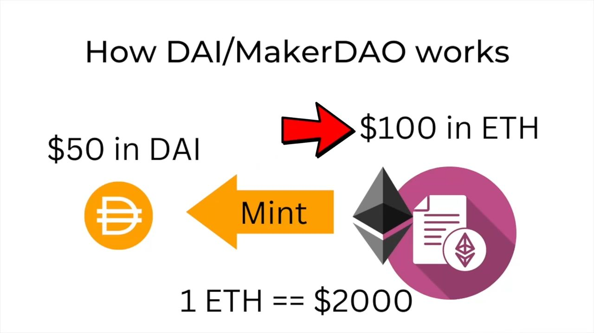

# Defi-stablecoin

## Three Functions of Money
1. STORAGE OF VALUE
2. UNIT OF ACCOUNT
3. MEDIUM OF EXCHANGE

## Categories properties

### Relative Stability
**Peg stable coins** are tied to that of a fiat currency, commodity, or other asset while **floating stable coins** use different mechanisms to maintain their buying power over time.

### Stability Method
**Algorithmic stable coins** use some sort of automated permissionless code to mint and burn tokens whereas a govern stable coins have some human interaction that mints and burns the coins and keep them stable.

### Collateral Type
If the stablecoin falls does the underlying collateral, also fall?
| Collateral Type | Description                | Example        |
|-----------------|----------------------------|-----------------|
| ENDOGENOUS      | Collateral is internal to the protocol (e.g., native tokens) | UST (with Luna)     |
| EXOGENOUS       | Collateral is external to the protocol (e.g., fiat, other assets) | USDT, USDC, DAI(with ETH)     |

## DAI

1. Collateralization
    - A user locks up $100 worth of ETH into a smart contract on MakerDAO.
    - Example: If 1 ETH = $2000, then the user deposits 0.05 ETH (worth $100)
2. Minting DAI
    - The user can now mint DAI against the locked ETH.
    - Example: The user can mint $50 worth of DAI.
    - You must deposit more value in ETH than the DAI you borrow to ensure system stability.
3. Debt and Stability
    - The DAI minted is essentially a loan backed by the ETH collateral.
    - If ETH price drops too much and collateral is no longer sufficient, the system liquidates the ETH to cover the issued DAI.

## Decentralized Stable Coin (DSC)
### Layout of Contract:
- version
- imports
- interfaces, libraries, contracts
- errors
- Type declarations
- State variables
- Events
- Modifiers
- Functions

### Layout of Functions:
- constructor
- receive function (if exists)
- fallback function (if exists)
- external
- public
- internal
- private
- view & pure functions